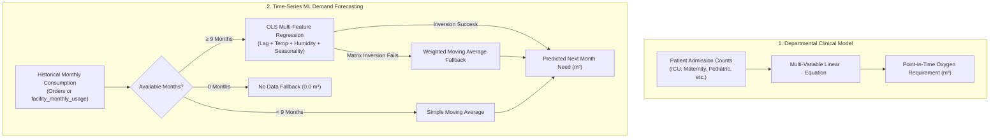

# AirX API 🏥⚡

> **Predictive Oxygen Demand Forecasting & Healthcare Logistics Management Platform**

AirX is a high-performance, lightweight REST API built to forecast hospital oxygen consumption, optimize medical gas supply chains, and deliver real-time analytics to healthcare administrators.

---

## 🚀 Tech Stack

* **Core Runtime**: PHP 7.3 or higher (PHP 7.3, 7.4, 8.0, 8.1, 8.2, 8.3)
* **API Framework**: [Slim Framework 3](https://www.slimframework.com/)
* **ORM & Database Abstraction**: [RedBeanPHP](https://redbeanphp.com/)
* **Database**: MySQL (5.7+ or 8.0+)
* **Authentication & Security**: [Firebase PHP-JWT](https://github.com/firebase/php-jwt) (Bearer Token validation, `HS256`, login rate-limiting)
* **Environment Management**: [vlucas/phpdotenv](https://github.com/vlucas/phpdotenv)
* **Continuous Integration**: GitHub Actions automated testing across PHP 7.3 – 8.3
* **ML / Prediction Engine**: Multi-tier engine combining linear clinical regression, historical autoregressive time-series OLS with meteorological normalization, and hold-out MAE/MAPE validation (Planned Roadmap: Dedicated `scikit-learn` / `XGBoost` Python microservice & deep time-series forecasting)

---

## 📁 Project Structure

```text
airx/
├── composer.json               # Dependencies, PHP >=7.3 requirement & PSR-4 autoloading
├── composer.lock               # Deterministic dependency lock file
├── .env.example                # Environment variable templates (APP_ENV, DB, JWT, AUTH_TOKEN)
├── .gitignore                  # Security rules & ignored directories
├── .htaccess                   # Apache URL rewriting & sensitive file blocking (403 Forbidden)
├── demo_monthly_usage.csv      # Compliant 12-month facility aggregated oxygen usage demo dataset
├── phpunit.xml.dist            # PHPUnit test runner configuration
├── .github/
│   └── workflows/
│       └── tests.yml           # CI test matrix across PHP 7.3 to 8.3
├── src/                        # PSR-4 Modular OOP Services & Configs
│   ├── Config/
│   │   └── Database.php        # Centralized DB setup, auto-migrations & multi-schema routing
│   └── Services/
│       ├── AuthService.php     # JWT generation, token verification & password hashing
│       ├── PredictorService.php# Oxygen prediction algorithms & DB persistence
│       └── HospitalService.php # Dashboard metrics, order retrieval & hospital setup
├── include/
│   ├── dbsol/                  # RedBeanPHP connection and ORM core
│   └── functions/              # Helper calculations & weather normalizations
├── scripts/
│   ├── generate_sample_csv.py  # Synthetic test data generation utility
│   └── migrations/
│       └── code_a3.sql         # SQL schema migration for predictions & support tables
├── tests/                      # Automated Test Suite (PHPUnit 9.6)
│   └── Services/
│       ├── AuthServiceTest.php     # Password hashing & JWT validation tests
│       ├── PredictorServiceTest.php# Clinical weights & forecasting tests
│       └── CsvIngestionTest.php    # CSV format & privacy compliance tests
└── v1/                         # API Endpoints & Routes
    ├── index.php               # System status, healthcheck & API help
    ├── authentication/         # User login, registration & rate-limiting
    ├── data/                   # Facility aggregated telemetry & batch CSV ingestion
    ├── hospital/               # Hospital management, orders, dashboard & support
    └── predictor/              # Oxygen requirement prediction engines
```

---

## 🛠️ Getting Started

### Prerequisites
* PHP 7.3 or higher (PHP 7.3, 7.4, 8.0, 8.1, 8.2, 8.3)
* Composer 2.x
* MySQL Server (5.7+ or 8.0+)
* Apache (with `mod_rewrite` enabled) or Nginx

### Installation

1. **Clone the Repository**:
   ```bash
   git clone https://github.com/LifeBank-New/Airx.git
   cd Airx
   ```

2. **Install Dependencies**:
   ```bash
   composer install
   ```

3. **Configure Environment Variables**:
   Copy `.env.example` to `.env` and fill in your database credentials and secret keys:
   ```bash
   cp .env.example .env
   ```

   Edit `.env`:
   ```env
   APP_ENV=development
   DB_HOST=localhost
   DB_USER=your_db_user
   DB_PASS=your_db_password
   DB_NAME=airx
   JWT_SECRET=your_super_secret_jwt_key_at_least_32_chars
   AUTH_TOKEN=your_secure_internal_api_token_at_least_24_chars
   OPENWEATHER_API_KEY=your_openweather_api_key
   ```
   > ⚠️ **Security Notice:** `AUTH_TOKEN` must be at least 24 characters and cannot be set to `'test'`. All endpoints enforce a strict server-level hard stop if invalid.

4. **Run Database Migrations**:
   AirX auto-migrates missing columns (`predictions.method`, `predictions.accuracy`, `support.created_at`, `support.updated_at`, `facility_monthly_usage`) upon connection before database freezing. You can also run the SQL script directly:
   ```bash
   mysql -u your_db_user -p airx < scripts/migrations/code_a3.sql
   ```

5. **Run Locally**:
   Using PHP's built-in development server:
   ```bash
   php -S localhost:8000 -t .
   ```

6. **Run Test Suite**:
   ```bash
   vendor/bin/phpunit
   ```

---

## 📡 API Endpoints Overview

All protected endpoints require an `Authorization` header containing a valid Bearer JWT:
```http
Authorization: Bearer <your_jwt_token>
```
Alternatively, internal automation and shared microservices authenticate via the `AUTH_TOKEN` bearer header.

### 1. Authentication (`/v1/authentication`)
| Method | Endpoint | Description |
| :--- | :--- | :--- |
| `POST` | `/v1/authentication/login` | Authenticate with email and password; returns JWT token with role (`hospital` or `supervisor`). Rate-limited to 5 failed attempts per 15 minutes (HTTP 429). |
| `POST` | `/v1/authentication/add/user` | Register a new hospital staff account (writes to both `secure_login` and `user`). |
| `POST` | `/v1/authentication/supervisor/add/user` | Register an administrative/supervisor account. |

### 2. Predictor Engine (`/v1/predictor`)
| Method | Endpoint | Description |
| :--- | :--- | :--- |
| `POST` | `/v1/predictor/run` | Predict oxygen demand (in $m^3$) using real-time patient census counts. Accepts standard and typo-tolerant parameter names. |
| `POST` | `/v1/predictor/run/supervisor` | Run supervisor-weighted linear prediction calculation for constrained supply buffers. |
| `GET` | `/v1/predictor/hospitals` | Retrieve last 6 months of historical consumption vs. prediction comparisons for charts. Scoped to authenticated hospital. |
| `GET` | `/v1/predictor/hospital/predict` | Predict next month's demand using time-series OLS & meteorological trends with hold-out validation. Falls back to `facility_monthly_usage`. |

#### Example Prediction Request (`POST /v1/predictor/run`):
```json
{
  "hospitalid": 101,
  "pediatric": 14,
  "malaria": 8,
  "intensive": 5,
  "accident": 2,
  "theatre": 3,
  "maternity": 4,
  "typhoid": 1,
  "diabetes": 2
}
```
*(Note: Legacy field spellings such as `peaditric` and `materinity` are also supported for backwards compatibility).*

### 3. Hospital Operations & Orders (`/v1/hospital`)
| Method | Endpoint | Description |
| :--- | :--- | :--- |
| `GET` | `/v1/hospital/dashboard` | Returns usage charts, upcoming deliveries, and `forecast_need` in $m^3$. |
| `GET` | `/v1/hospital/orders` | Retrieves recent oxygen orders filtered by status. |
| `POST` | `/v1/hospital/placeorder` | Place an oxygen order (Large, Medium, or Small cylinders). Unpriced products are recorded with `unitprice: null`, `'price_pending': true`, and status `"Awaiting Pick Up"`. |
| `POST` | `/v1/hospital/support` | Submit a hospital support inquiry with automatic timestamp tracking. |

### 4. Facility Telemetry & Data Ingestion (`/v1/data`)
| Method | Endpoint | Description |
| :--- | :--- | :--- |
| `POST` | `/v1/data/add` | Log a single monthly oxygen consumption record for a facility (`period` and `oxygen_used_m3`). |
| `POST` | `/v1/data/hospital/add` | Batch upload facility monthly usage records via JSON array or CSV file. |
| `GET` | `/v1/data/hospital` | Retrieve aggregated monthly usage and comparative prediction charts. |

> 🛡️ **Privacy by Design:**
> AirX stores **facility-level monthly totals only** and strictly rejects any record containing patient-level attributes (`gender`, `age`, `conditions`, `treatment`, `flow_rate`, `estimate_need`) with HTTP **`422 Unprocessable Entity`**.
>
> Sample compliant CSV (`demo_monthly_usage.csv`):
> ```csv
> period,oxygen_used_m3
> 2025-10,312.45
> 2025-11,298.10
> 2025-12,345.80
> ```

---

## 🧠 Predictor Architecture

AirX implements a multi-tiered predictive architecture tailored to both **real-time clinical caseloads** and **long-term historical procurement patterns**.



### 1. Clinical / Departmental Needs Model
**Files:** [`src/Services/PredictorService.php`](src/Services/PredictorService.php)  
**Endpoints:** `POST /v1/predictor/run`, `POST /v1/predictor/run/supervisor`

This model computes instantaneous oxygen demand based on clinical ward census and active patient diagnoses using calibrated regression weights:

$$\begin{aligned}
\text{Needs (Standard)} = 13.01 &+ 3.5123 \cdot \text{Pediatric} + 5.4793 \cdot \text{Malaria} + 2.2490 \cdot \text{ICU} \\
&+ 6.8767 \cdot \text{Accident/Emergency} + 0.1935 \cdot \text{Theatre} + 5.9922 \cdot \text{Maternity} \\
&- 10.1190 \cdot \text{Typhoid} - 6.0203 \cdot \text{Diabetes}
\end{aligned}$$

* **Primary Drivers**: Trauma/Accidents ($+6.88$), Maternity ($+5.99$), Malaria ($+5.48$), and Pediatric ($+3.51$) carry the largest oxygen demand coefficients per patient.
* **Supervisor Mode**: Adjusts the base constant to $13.1414$ and pediatric coefficient to $3.7123$ to provide safety margins during supply constraints.

### 2. Time-Series Machine Learning Model
**Files:** [`include/functions/helper.php`](include/functions/helper.php), [`src/Services/PredictorService.php`](src/Services/PredictorService.php)  
**Endpoint:** `GET /v1/predictor/hospital/predict`

This model forecasts **next month's total oxygen consumption (in $m^3$)** through a 4-tier pipeline:

#### Tier A: Ordinary Least Squares (OLS) Multiple Regression ($\ge 9$ historical months)
Solves the normal equations $\beta = (X^T X)^{-1} X^T y$ across historical monthly data:
* **Feature Vector ($X$)**:
  1. $x_0 = 1$ — Model intercept.
  2. $x_1 = \text{total\_cubic\_meters}_{t-1}$ — Autoregressive lag-1 (previous month's consumption volume).
  3. $x_2 = \text{avg\_temp}_{t-1}$ — Climatological average ambient temperature.
  4. $x_3 = \text{avg\_humidity}_{t-1}$ — Climatological relative humidity.
  5. $x_4 = \sin(2\pi \cdot \text{month} / 12)$ — Cyclical seasonal harmonic component.
  6. $x_5 = \cos(2\pi \cdot \text{month} / 12)$ — Cyclical seasonal harmonic component.
* **Prediction Formulation**:
  $$\hat{y} = \max(0, x_{\text{next}} \cdot \beta) \times \text{locationFactor}$$

#### Tier B: Weighted Moving Average Fallback
If $(X^T X)$ cannot be inverted due to multicollinearity, it smoothly falls back to a linearly weighted moving average:
$$w_i = \frac{i + 1}{N}$$
Recent months receive higher weight, adjusted for trend stability.

#### Tier C: Simple Moving Average ($< 9$ historical months)
For facilities with limited transaction records (1–8 months), it computes the arithmetic mean scaled by facility location factors.

#### Tier D: No Data Fallback ($0$ historical months)
Returns `0.0` with `method: "no_data"` and `accuracy: 0.0%`.

### 3. Honest Model Accuracy Scoring
Accuracy is evaluated dynamically using out-of-sample hold-out validation:
* **Hold-Out Validation**: Reserves the last 3 months of historical data for validation.
* **Metrics**: Evaluates Mean Absolute Error (MAE) and Mean Absolute Percentage Error (MAPE) against the held-out months:
  $$\text{Accuracy} = \max\left(0, 1 - \min(\text{MAPE}, 1)\right) \times 100\%$$
* **Transparent Reporting**: No artificial accuracy caps; published accuracy reflects true out-of-sample forecast capability.

### 4. Telemetry & Audit Persistence
Every prediction run records telemetry to the `predictions` table (`hospital_id`, `predictions`, `method`, `accuracy`, `tym`), ensuring transparent auditing and longitudinal tracking on the hospital dashboard.

### 5. Planned Future Prediction Model Roadmap 🔮
While the current production architecture executes high-efficiency in-process OLS multiple regression and seasonal moving averages natively in PHP 7.3+, the platform design includes a planned multi-phase Machine Learning roadmap:

* **Phase 1 (Microservice Architecture)**:
  * Extract time-series prediction endpoints to an asynchronous Python microservice utilizing `scikit-learn` and `FastAPI`.
  * Communicate between the Slim PHP core and the Python ML service via secure internal tokens (`AUTH_TOKEN`).
* **Phase 2 (Advanced Non-Linear Forecasting)**:
  * **Gradient Boosted Decision Trees (`XGBoost` / `LightGBM`)**: Model non-linear interactions between multi-city climatological patterns, holiday surges, epidemic outbreaks, and regional oxygen consumption.
  * **Probabilistic Forecasting (`Prophet` / NeuralProphet)**: Generate dynamic confidence intervals ($P_{10}$, $P_{50}$, $P_{90}$) to inform adaptive safety buffers and automated reorder points.
* **Phase 3 (Deep Sequential Learning)**:
  * **LSTM & Temporal Fusion Transformers (TFT)**: Ingest multi-facility historical consumption sequences paired with static facility metadata (bed capacity, ICU beds, oxygen plant presence) and dynamic covariates.
* **Phase 4 (Automated Continuous Retraining & MLOps)**:
  * Automated retraining pipelines triggered upon monthly batch CSV telemetry ingestion.
  * Model registry tracking model drift, out-of-sample MAPE metrics, and canary rollout of candidate models.

---

## 🔒 Security & Data Integrity

* **Data Minimization & Privacy**: Strictly facility-level monthly totals; patient-level clinical records are rejected on upload (HTTP 422).
* **Token-Scoped Access Control**: Authenticated hospitals automatically access only their own facility records via JWT `ref_id`.
* **Login Rate-Limiting**: 5 failed login attempts per IP or email within 15 minutes triggers an HTTP `429 Too Many Requests` lockout.
* **Shared Table Protection**: Legacy password hashes in the shared `secure_login` table are preserved without destructive rehashing.
* **SQL Injection Prevention**: All queries use parameterized statements (`?` binding) with RedBeanPHP.
* **Server Hardening & Dotfile Protection**: Apache rules block direct access to `.env`, `.git`, `tests/`, and sensitive files with HTTP `403 Forbidden`.
* **Masked Internal Errors**: Server-side error stack traces are safely logged via `error_log()` while clients receive sanitized, non-revealing error messages.

---

## 🧪 Testing & CI

AirX uses **PHPUnit 9.6** with an automated **GitHub Actions CI** pipeline testing across PHP 7.3 through 8.3:

```bash
# Run unit tests locally
vendor/bin/phpunit

# Run tests with testdox format
vendor/bin/phpunit --testdox
```

Test coverage includes:
* `AuthServiceTest`: Password hashing, bcrypt verification, and JWT generation/validation.
* `PredictorServiceTest`: Standard and supervisor clinical weight algorithms, prediction persistence, and time-series calculations.
* `CsvIngestionTest`: Facility monthly usage format verification and rejection of prohibited patient telemetry.

---

## 👥 Authors & Maintainers

* **LifeBank Tech Team** — [developer@lifebank.ng](mailto:developer@lifebank.ng)
* Website: [lifebank.ng](https://lifebank.ng)
