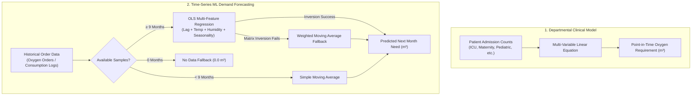

# AirX API 🏥⚡

> **Predictive Oxygen Demand Forecasting & Healthcare Logistics Management Platform**

AirX is a high-performance, lightweight REST API built to forecast hospital oxygen consumption, optimize medical gas supply chains, and deliver real-time analytics to healthcare administrators.

---

## 🚀 Tech Stack

* **Core Runtime**: PHP 8.x / 7.4+
* **API Framework**: [Slim Framework 3](https://www.slimframework.com/)
* **ORM & Database Abstraction**: [RedBeanPHP](https://redbeanphp.com/)
* **Database**: MySQL
* **Authentication & Security**: [Firebase PHP-JWT](https://github.com/firebase/php-jwt) (Bearer Token validation, `HS256`)
* **Environment Management**: [vlucas/phpdotenv](https://github.com/vlucas/phpdotenv)
* **ML / Prediction Engine**: Native Linear Regression with meteorological normalization and moving averages (Future roadmap: `scikit-learn` Python microservice)

---

## 📁 Project Structure

```text
airx/
├── composer.json               # Dependencies and PSR-4 autoloading
├── .env.example                # Environment variable templates
├── .gitignore                  # Security rules & ignored directories
├── src/                        # PSR-4 Modular OOP Services & Configs
│   ├── Config/
│   │   └── Database.php        # Centralized DB setup & multi-schema routing
│   └── Services/
│       ├── AuthService.php     # JWT generation, token verification & password hashing
│       ├── PredictorService.php# Oxygen prediction algorithms & DB persistence
│       └── HospitalService.php # Dashboard metrics, order retrieval & hospital setup
├── include/
│   ├── dbsol/                  # RedBeanPHP connection and ORM core
│   └── functions/              # Helper calculations & weather API
└── v1/                         # API Endpoints & Routes
    ├── index.php               # System status & API help
    ├── authentication/         # User login & registration endpoints
    ├── data/                   # Clinical telemetry & batch CSV ingestion
    ├── hospital/               # Hospital management, orders & support
    └── predictor/              # Oxygen requirement prediction engines
```

---

## 🛠️ Getting Started

### Prerequisites
* PHP >= 7.3 or PHP 8.x
* Composer
* MySQL Server (5.7+ or 8.0+)
* Apache (with `mod_rewrite` enabled) or Nginx

### Installation

1. **Clone the Repository**:
   ```bash
   git clone https://github.com/LifeBank-New/Airx.git
   cd Airx
   ```

2. **Install Dependencies**:
   ```bash
   composer install --no-dev
   ```

3. **Configure Environment Variables**:
   Copy `.env.example` to `.env` and fill in your database credentials and secret keys:
   ```bash
   cp .env.example .env
   ```

   Edit `.env`:
   ```env
   DB_HOST=localhost
   DB_USER=your_db_user
   DB_PASS=your_db_password
   DB_NAME=airx
   JWT_SECRET=your_super_secret_jwt_key
   AUTH_TOKEN=your_internal_api_token
   OPENWEATHER_API_KEY=your_openweather_api_key
   ```

4. **Run Locally**:
   Using the built-in PHP development server:
   ```bash
   php -S localhost:8000 -t .
   ```

---

## 📡 API Endpoints Overview

All protected endpoints require an `Authorization` header containing a valid Bearer JWT:
```http
Authorization: Bearer <your_jwt_token>
```

### 1. Authentication (`/v1/authentication`)
| Method | Endpoint | Description |
| :--- | :--- | :--- |
| `POST` | `/v1/authentication/login` | Authenticate with email and password; returns JWT token. |
| `POST` | `/v1/authentication/add/user` | Register a new hospital staff account with secure password hashing. |
| `POST` | `/v1/authentication/supervisor/add/user` | Register an administrative/supervisor account. |

### 2. Predictor Engine (`/v1/predictor`)
| Method | Endpoint | Description |
| :--- | :--- | :--- |
| `POST` | `/v1/predictor/run` | Predict oxygen demand (in $m^3$) using real-time patient counts. |
| `POST` | `/v1/predictor/run/supervisor` | Run supervisor-weighted linear prediction calculation. |
| `GET` | `/v1/predictor/hospitals` | Retrieve last 6 months of historical usage vs. prediction comparisons. |
| `GET` | `/v1/predictor/hospital/predict` | Predict next month's demand using time-series & meteorological trends. |

#### Example Prediction Request (`POST /v1/predictor/run`):
```json
{
  "hospitalid": 101,
  "peaditric": 14,
  "malaria": 8,
  "intensive": 5,
  "accident": 2,
  "theatre": 3,
  "materinity": 4,
  "typhoid": 1,
  "diabetes": 2
}
```

### 3. Hospital Operations & Orders (`/v1/hospital`)
| Method | Endpoint | Description |
| :--- | :--- | :--- |
| `GET` | `/v1/hospital/dashboard` | Returns usage charts, upcoming deliveries, and stock estimates. |
| `GET` | `/v1/hospital/orders` | Retrieves recent oxygen orders filtered by status. |
| `POST` | `/v1/hospital/placeorder` | Place an oxygen order (Large, Medium, or Small cylinders). |
| `POST` | `/v1/hospital/support` | Submit a hospital support inquiry. |

### 4. Telemetry & Data Ingestion (`/v1/data`)
| Method | Endpoint | Description |
| :--- | :--- | :--- |
| `POST` | `/v1/data/add` | Log single patient medical telemetry data point. |
| `POST` | `/v1/data/hospital/add` | Batch upload historical records via JSON template or CSV file. |

---

## 🧠 Predictor Architecture

AirX implements a multi-tiered predictive architecture tailored to both **real-time clinical caseloads** and **long-term historical procurement patterns**.



### 1. Clinical / Departmental Needs Model
**Files:** [`src/Services/PredictorService.php`](file:///Applications/MAMP/htdocs/airx/src/Services/PredictorService.php)  
**Endpoints:** `POST /v1/predictor/run`, `POST /v1/predictor/run/supervisor`

This model computes instantaneous oxygen demand based on clinical ward census and active patient diagnoses using pre-trained linear regression weights:

$$\begin{aligned}
\text{Needs (Standard)} = 13.01 &+ 3.5123 \cdot \text{Pediatric} + 5.4793 \cdot \text{Malaria} + 2.2490 \cdot \text{ICU} \\
&+ 6.8767 \cdot \text{Accident/Emergency} + 0.1935 \cdot \text{Theatre} + 5.9922 \cdot \text{Maternity} \\
&- 10.1190 \cdot \text{Typhoid} - 6.0203 \cdot \text{Diabetes}
\end{aligned}$$

* **Primary Drivers**: Trauma/Accidents ($+6.88$), Maternity ($+5.99$), Malaria ($+5.48$), and Pediatric ($+3.51$) carry the largest oxygen demand coefficients per patient.
* **Supervisor Mode**: Adjusts the base constant to $13.1414$ and pediatric coefficient to $3.7123$ to provide higher safety margins during periods of supply constraint.

### 2. Time-Series Machine Learning Model
**Files:** [`include/functions/helper.php`](file:///Applications/MAMP/htdocs/airx/include/functions/helper.php), [`src/Services/PredictorService.php`](file:///Applications/MAMP/htdocs/airx/src/Services/PredictorService.php)  
**Endpoint:** `GET /v1/predictor/hospital/predict`

This model forecasts **next month's total oxygen consumption (in $m^3$)** through a 4-tier fallback pipeline:

#### Tier A: Ordinary Least Squares (OLS) Multiple Regression ($\ge 9$ historical months)
Solves the normal equations $\beta = (X^T X)^{-1} X^T y$ across historical monthly data:
* **Feature Vector ($X$)**:
  1. $x_0 = 1$ — Model intercept.
  2. $x_1 = \text{total\_cubic\_meters}_{t-1}$ — Autoregressive lag-1 (previous month's consumption volume).
  3. $x_2 = \text{avg\_temp}_{t-1}$ — Average ambient temperature (retrieved via OpenWeatherMap API or regional climatological baseline).
  4. $x_3 = \text{avg\_humidity}_{t-1}$ — Average relative humidity.
  5. $x_4 = \sin(2\pi \cdot \text{month} / 12)$ — Cyclical seasonal harmonic component.
  6. $x_5 = \cos(2\pi \cdot \text{month} / 12)$ — Cyclical seasonal harmonic component.
* **Prediction Formulation**:
  $$\hat{y} = \max(0, x_{\text{next}} \cdot \beta) \times \text{locationFactor}$$

#### Tier B: Weighted Moving Average Fallback
If $(X^T X)$ cannot be inverted due to high collinearity or uniform history, it transitions to a linearly weighted moving average:
$$w_i = \frac{i + 1}{N}$$
Recent months are prioritized with higher weights, adjusted by trend stability.

#### Tier C: Simple Moving Average ($< 9$ historical months)
For facilities with limited transaction records (1–8 months), it uses the arithmetic mean scaled by facility location factors.

#### Tier D: No Data Fallback ($0$ historical months)
Returns `0.0` with `method: "no_data"` and `accuracy: 0.0%`.

### 3. Model Accuracy Scoring
Accuracy is evaluated dynamically on each run:
* **OLS Regression**: Blends $R^2$ (Coefficient of Determination, 70% weight) and MAPE (Mean Absolute Percentage Error, 30% weight):
  $$\text{Accuracy} = \left(0.70 \cdot R^2 + 0.30 \cdot (1 - \min(\text{MAPE}, 1))\right) \times 100$$
* **Moving Average**: Computed from sample variance ($\sigma / \mu$) and month-over-month trend stability, capped at $90\text{--}95\%$.

### 4. Telemetry & Persistence
Every execution of the prediction engine logs telemetry to the `predictions` table (`hospital_id`, `predictions`, `method`, `accuracy`, `tym`), ensuring transparent auditing and longitudinal tracking on the hospital dashboard.

---

## 🔒 Security & Data Integrity

* **SQL Injection Prevention**: All queries use parameterized statements (`?` binding) with RedBeanPHP.
* **Password Hashing**: Implements PHP native `password_hash()` (Bcrypt/Argon2) with backward-compatible legacy verification.
* **Stateless Authentication**: JWT tokens signed with secure keys and configurable expiration.
* **Data Minimization**: No patient-level data: AirX stores facility-level monthly totals only, and rejects any record containing patient attributes.

---

## 👥 Authors & Maintainers

* **LifeBank Tech Team** — [developer@lifebank.ng](mailto:developer@lifebank.ng)
* Website: [lifebank.ng](https://lifebank.ng)
